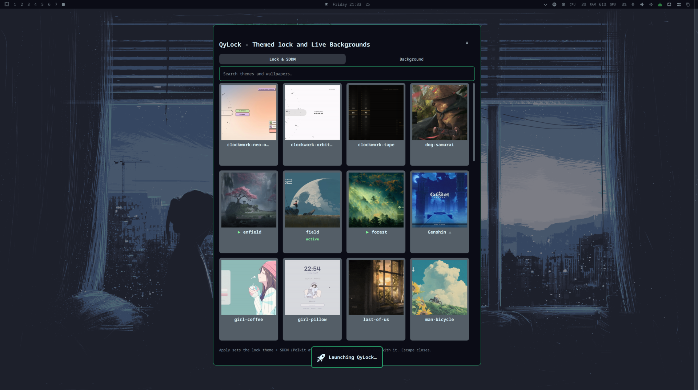
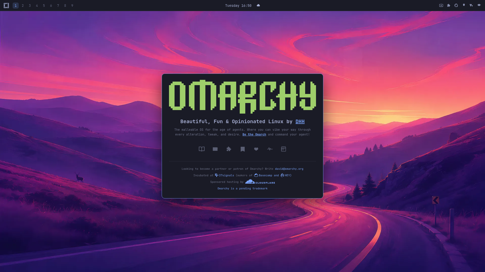
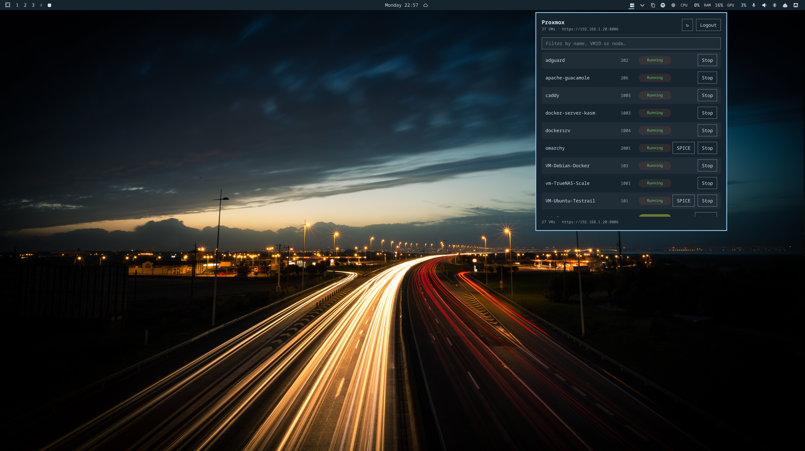
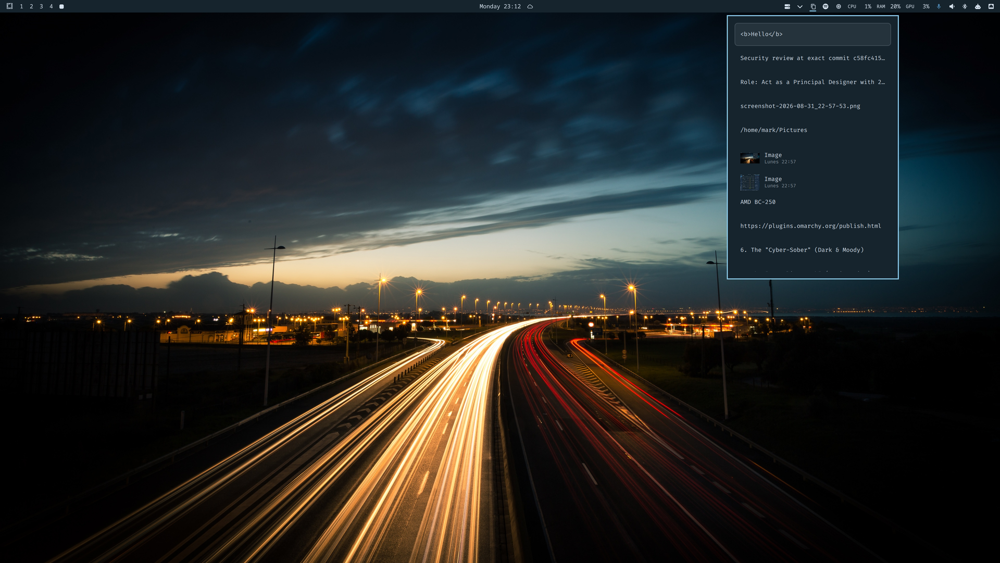
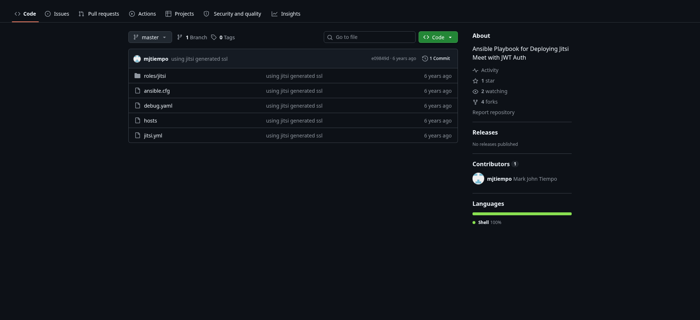

# mjtiempo.github.io

The personal GitHub Pages site of **Mark John Tiempo** (`mjtiempo`) — a two-tile desktop in the browser, styled after the [Omarchy](https://omarchy.org) shell: top bar with live clock and weather, and two Hyprland-style tiled windows side by side. The profile tile and the repository list are fetched live from the GitHub API.

**Live:** https://mjtiempo.github.io/

---

## [qylock-oma](https://github.com/mjtiempo/qylock-oma) — new

An [Omarchy](https://omarchy.org) shell plugin that manages lock themes, SDDM themes, and wallpapers: a themed picker for lock and SDDM themes, a background switcher (bundled + system wallpapers), and experimental video backgrounds. Themes are fetched on demand from the [qylock](https://github.com/Darkkal44/qylock) collection (a fork of which is [mirrored here](https://github.com/mjtiempo/qylock)), listed via the lightweight [qylock-oma-catalog](https://github.com/mjtiempo/qylock-oma-catalog) catalog repo.

## [qylock-oma-catalog](https://github.com/mjtiempo/qylock-oma-catalog) — new

The theme catalog for **qylock-oma**: the theme list (`index.json`) + preview images that populate the plugin's theme grid. Heavy theme assets are not stored here — they're fetched from upstream on Apply/Preview.

## [omarchy-site](https://github.com/mjtiempo/omarchy-site) — new

An interactive re-imagining of [omarchy.org](https://omarchy.org): the whole site is an Omarchy desktop. Top bar with logo, workspaces, clock/calendar, weather, and system icons; a launcher menu with search; 9 themed workspaces (each a built-in Omarchy theme + its default wallpaper); a tiled video wall on workspace 2; full-tile app pages (Manual, News, Teams, Patrons, Sponsorships, AIR, Meetups) on workspaces 3–9; and closable Security/Brand popups. Vanilla HTML/CSS/JS — no build step, GitHub Pages ready. This site's design language comes from it.

## [omarchy-proxmox-client](https://github.com/mjtiempo/omarchy-proxmox-client) — new

A Proxmox client widget for the Omarchy bar — a Quickshell bar widget and panel (QML) that lists Proxmox nodes, VMs, and guests with their status right on the desktop.

## [omarchy-clippy](https://github.com/mjtiempo/omarchy-clippy) — new

An Omarchy shell widget (QML/Quickshell) for the clipboard: a clipboard bar with history, favorites, image clips, and quick-access actions — clipped right on the desktop.

## [jitsimeet-jwt-ansible](https://github.com/mjtiempo/jitsimeet-jwt-ansible) — older

Ansible playbook for deploying [Jitsi Meet](https://jitsi.org) with JWT auth — roles for the meet, components, and auth stack (Shell, ⭐ 1, ⑂ 4).

---

The full live list (all repos, ordered by most recently updated) is on the site: https://mjtiempo.github.io/
